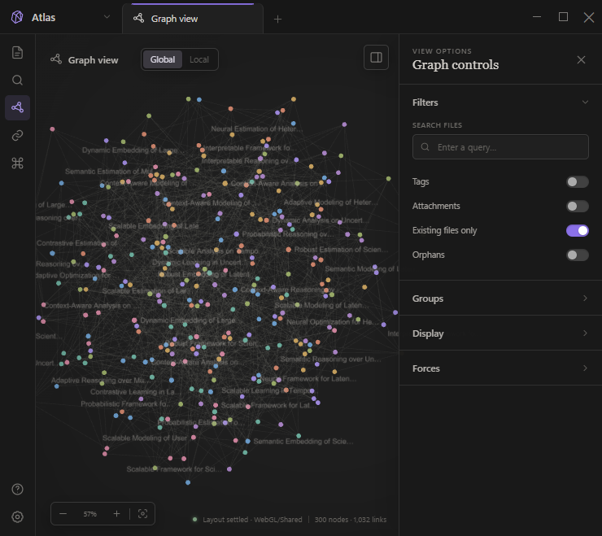

# Atlas Graph Prototype

一个受 Obsidian Graph View 启发的浏览器端交互式知识图谱原型。仓库提供两个独立版本：用于展示关系强弱的**加权文献图谱**，以及将所有关系视为等价连接的**无权重 Vault 图谱**。



## 两个版本

| 子项目 | 默认数据 | 边的含义 | 开发命令 |
| --- | --- | --- | --- |
| `apps/weighted` | 300 个模拟文献节点、1,032 条相似度边 | 相似度影响弹簧距离、弹簧强度和边的基础视觉 | `npm run dev` 或 `npm run dev:weighted` |
| `apps/unweighted-obsidian` | 167 篇模拟 Vault 笔记及其标签、附件和未解析引用 | 每条关系使用相同的基础弹簧公式、距离和线条样式 | `npm run dev:unweighted` |

两个版本都完全运行在浏览器中，不需要后端或数据库，也不会读取或修改真实 Obsidian Vault。

## 功能

两个版本共享以下交互能力：

- Global 与 Local 图谱，以及 1–5 层局部邻域展开；
- 节点悬停、选择、拖拽、固定、双击和右键菜单；
- 画布平移、指针中心缩放、自动适配和节点聚焦；
- 快速搜索、组合过滤和可编辑分组着色；
- 标签、附件、未解析链接和孤立节点显示控制；
- 节点大小、边宽、箭头、标签阈值和力导参数实时调节；
- PixiJS 图形渲染与 Canvas 2D 回退；
- Web Worker 力导布局、四叉树空间索引、Barnes–Hut 斥力近似和碰撞投影；
- 跨源隔离环境下的 `SharedArrayBuffer` 快路径，以及普通环境下的 Transfer 模式。

### 加权版本

加权版本模拟文献相似度网络。每条边的 `similarity` 会影响目标距离、弹簧强度和基础强调程度，并提供按创建年份播放的时间演化动画。

### 无权重版本

无权重版本模拟 Obsidian Vault：

- 所有可见关系在布局中使用同一目标距离和弹簧强度；
- 所有普通关系使用同一基础颜色、透明度和粗细；
- 边的视觉差异只来自悬停、选择、搜索或局部上下文；
- 笔记半径由 degree 和节点类型决定，不使用边权；
- 默认颜色组来自 Vault 顶层文件夹；
- tag、attachment、unresolved 和 orphan 使用固定系统色与不同节点形状；
- 标签、附件和未解析节点从笔记元数据推导，孤立笔记由基础 wiki 图中的 degree 0 自动识别。

## 技术栈

- 原生 HTML、CSS、JavaScript ES Modules
- PixiJS 8.16.0
- Vite 7.1.7
- Web Worker
- 自研四叉树、Barnes–Hut 力计算与碰撞处理

## 快速开始

### 环境要求

Vite 7 要求 Node.js `20.19+` 或 `22.12+`，同时需要 npm。

### 安装依赖

```bash
npm install
```

### 开发

```bash
# 默认：加权版本
npm run dev

# 显式启动加权版本
npm run dev:weighted

# 启动无权重 Vault 版本
npm run dev:unweighted
```

开发服务器仅监听 `127.0.0.1`。请打开终端中 Vite 输出的本地地址。

### 构建

```bash
npm run build:weighted
npm run build:unweighted
```

构建产物分别位于：

```text
apps/weighted/dist/
apps/unweighted-obsidian/dist/
```

构建配置会把当前应用的 `graph-data.js` 复制到对应 `dist/`。

### 预览

```bash
npm run preview:weighted
npm run preview:unweighted
```

## 使用说明

### 鼠标操作

| 操作 | 效果 |
| --- | --- |
| 单击节点 | 选中节点并打开详情卡 |
| 拖拽节点 | 调整节点位置；固定节点在释放后保持位置 |
| 拖拽空白区域 | 平移画布 |
| 滚轮 | 以指针位置为中心缩放 |
| 双击节点 | 以该节点打开 Local graph |
| 双击空白区域 | 自动适配当前图谱 |
| 右键节点 | 打开操作菜单，可模拟打开笔记、进入局部图、固定或复制 `[[Obsidian Link]]` |

### 键盘快捷键

| 快捷键 | 效果 |
| --- | --- |
| `Ctrl/Command + F` 或 `/` | 打开快速搜索 |
| `Enter` | 聚焦第一个搜索结果 |
| `Esc` | 关闭搜索、右键菜单或清除选择 |
| `+` / `-` | 放大 / 缩小 |
| `0` | 适配当前图谱 |
| 方向键 | 平移画布 |
| `Shift + 方向键` | 快速平移画布 |
| `Space` | 仅加权版本：播放或暂停创建时间动画 |

### 控制面板

1. **Filters**：过滤节点，切换 tags、attachments、existing files 和 orphans；Local 模式下可调整邻域深度。
2. **Groups**：启用、停用或编辑颜色组，也可添加自定义查询组。
3. **Display**：控制箭头、标签阈值、节点大小和边粗细；加权版本还提供时间动画。
4. **Forces**：实时调节中心力、斥力、连边力和连边距离。

无权重版本中的 **Existing files only** 默认开启；关闭后才会显示由 `unresolved[]` 推导的未解析引用节点。

## 查询语法

多个条件采用 AND 关系；字段值包含空格时可使用双引号；在任意条件前添加 `-` 可排除匹配项。

### 无权重 Vault 版本

| 语法 | 示例 | 含义 |
| --- | --- | --- |
| 普通文本 | `atlas` | 匹配名称、别名、路径、文件夹、标签或类型 |
| `path:` | `path:"03 Projects"` | 按路径包含关系匹配 |
| `folder:` | `folder:"03 Projects"` | 按文件夹匹配 |
| `tag:` | `tag:review` | 按标签匹配 |
| `type:` | `type:note` | 按节点类型匹配 |
| `is:` | `is:orphan` | 匹配 orphan、attachment 或 unresolved |
| 排除 | `tag:project -tag:archive` | 保留项目标签并排除归档标签 |

可用类型包括 `note`、`tag`、`attachment`、`unresolved` 和 `orphan`。

### 加权文献版本

加权版本保留 `topic:`、`path:`、`type:`、`year:` 和 `-` 排除语法，例如：

```text
topic:"Knowledge Graph" year:2024 -type:attachment
```

## 图谱数据

两个页面都要求在 `app.js` 之前加载本目录的 `graph-data.js`。数据文件通过 `window.PRECOMPUTED_GRAPH_DATA` 注入，便于替换为其他预计算数据。

### 无权重 Vault schema

```js
window.PRECOMPUTED_GRAPH_DATA = {
  meta: {
    vaultName: "Atlas Vault",
    description: "Unweighted Vault graph"
  },
  nodes: [
    {
      id: "note:project-atlas-brief",
      name: "Project Atlas Brief",
      path: "03 Projects/Project Atlas Brief.md",
      folder: "03 Projects",
      tags: ["project", "atlas"],
      aliases: ["Atlas brief"],
      attachments: ["atlas-map.canvas"],
      unresolved: ["Atlas follow up"]
    }
  ],
  links: [
    {
      source: "note:project-atlas-brief",
      target: "note:project-atlas-architecture",
      type: "wiki"
    }
  ]
};
```

约束：

- `nodes[].id` 必须唯一；
- `links[].source` 和 `links[].target` 必须引用已存在的基础笔记 ID；
- 边不包含 `weight` 或 `similarity`；
- `tags`、`aliases`、`attachments` 和 `unresolved` 均为可选字符串数组；
- 附件与未解析引用会在运行时转换为独立节点及关系；
- 基础 wiki links 中 degree 为 0 的笔记会被标记为 orphan。

### 加权文献 schema

```js
window.PRECOMPUTED_GRAPH_DATA = {
  topics: ["Knowledge Graph"],
  nodes: [
    {
      id: "paper-1",
      name: "Example Paper (2024)",
      group: 0,
      topic: "Knowledge Graph",
      val: 42,
      degree: 1
    }
  ],
  links: [
    {
      source: "paper-1",
      target: "paper-2",
      similarity: 0.9
    }
  ]
};
```

加权版本使用 `similarity` 表达边权，并使用 `topic`、`val`、`degree` 和名称中的年份组织分组、节点重要性与时间动画。

## 项目结构

```text
.
├─ apps/
│  ├─ weighted/
│  │  ├─ index.html
│  │  ├─ styles.css
│  │  ├─ app.js
│  │  ├─ graph-renderer.js
│  │  ├─ graph-worker.js
│  │  ├─ graph-quadtree.js
│  │  └─ graph-data.js
│  └─ unweighted-obsidian/
│     ├─ index.html
│     ├─ styles.css
│     ├─ app.js
│     ├─ graph-renderer.js
│     ├─ graph-worker.js
│     ├─ graph-quadtree.js
│     └─ graph-data.js
├─ atlas-graph-preview.png
├─ package.json
├─ package-lock.json
├─ README.md
└─ vite.config.js
```

## 渲染与布局架构

1. `graph-data.js` 在页面加载时写入预计算数据。
2. `app.js` 归一化节点，推导可选实体，并根据模式、查询和开关构建当前可见图。
3. `graph-worker.js` 在独立线程中计算中心力、斥力、连边弹簧和碰撞约束。
4. 支持跨源隔离时，主线程与 Worker 通过 `SharedArrayBuffer` 共享位置；否则通过可转移数组传递快照。
5. `graph-renderer.js` 使用 PixiJS 绘制节点、边、箭头和标签；初始化失败时由 `app.js` 使用 Canvas 2D 回退渲染。

开发和预览服务器已设置：

```text
Cross-Origin-Opener-Policy: same-origin
Cross-Origin-Embedder-Policy: require-corp
```

部署静态产物时，如需继续使用 `SharedArrayBuffer`，托管平台也应提供这两个响应头；否则应用会自动使用 Transfer 模式。

## 当前边界

- 这是界面与图谱交互原型，不是 Obsidian 插件；
- 数据为确定性的模拟数据，不连接真实文件系统；
- “打开笔记”只提供界面反馈，复制链接受浏览器剪贴板权限限制；
- 配置、节点位置和固定状态不会持久化；
- 当前没有自动化测试脚本、后端服务或数据库；
- 仓库未提供许可证文件，在明确授权前请勿默认代码可自由再分发。
